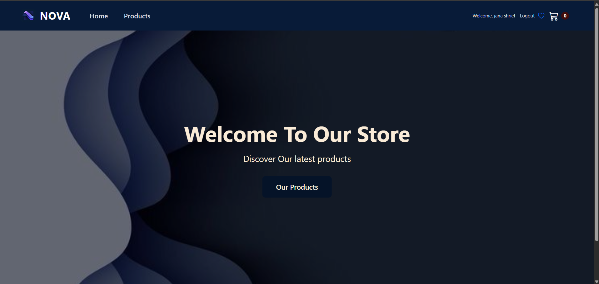
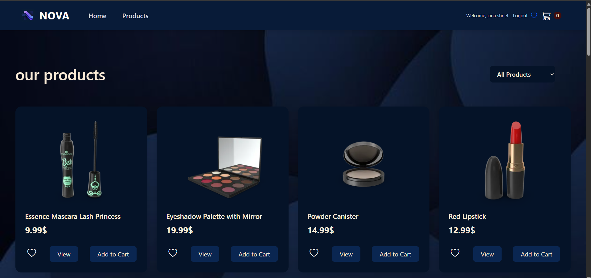
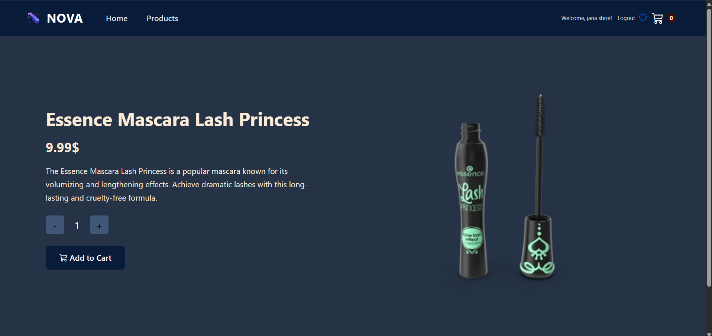
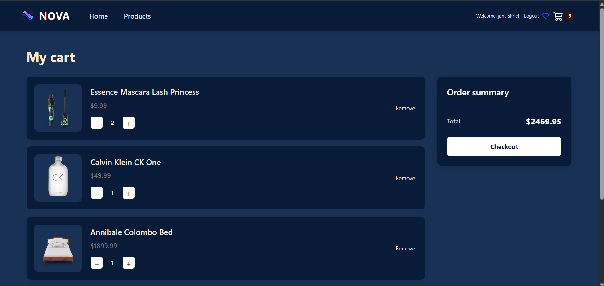
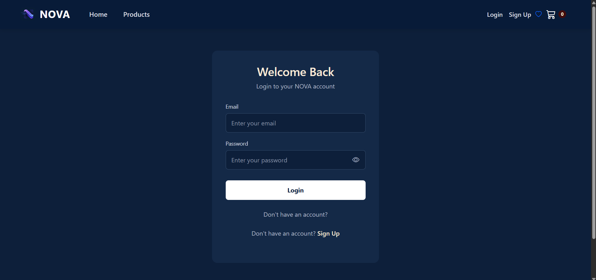
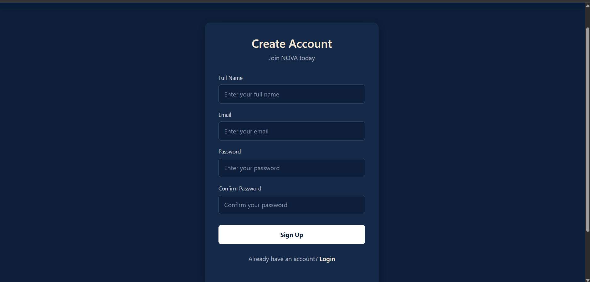
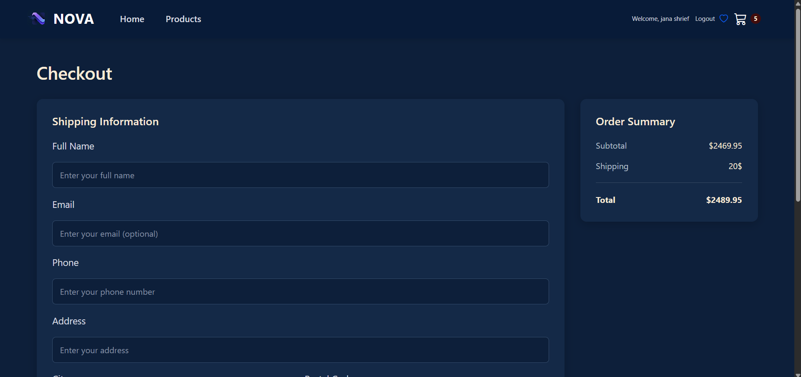
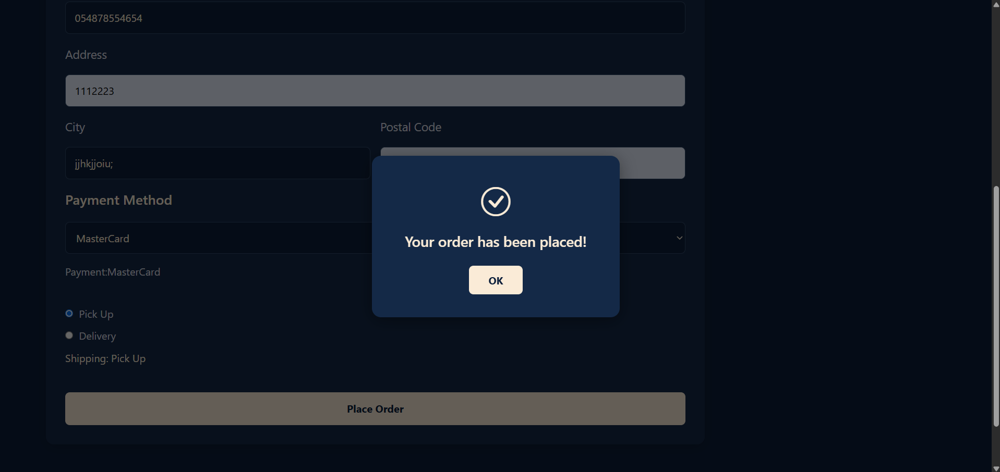

# E-Commerce Website

This is a simple e-commerce website built with React.
The project allows users to browse products, view product details, and manage their shopping cart.

## Features
* View products
* View product details
* Add products to the cart
* Increase and decrease product quantity
* Remove products from the cart
* Calculate the total price
* Login and Register
* Responsive design

## Technologies Used
* React
* JavaScript
* HTML
* CSS
* Bootstrap
* React Router DOM
* Axios
* Context API
* LocalStorage
* Vite

## Screenshots

### Home

### Products

### Product Details

### Cart

### Login

### Signup

### Checkout

### Order Placed
